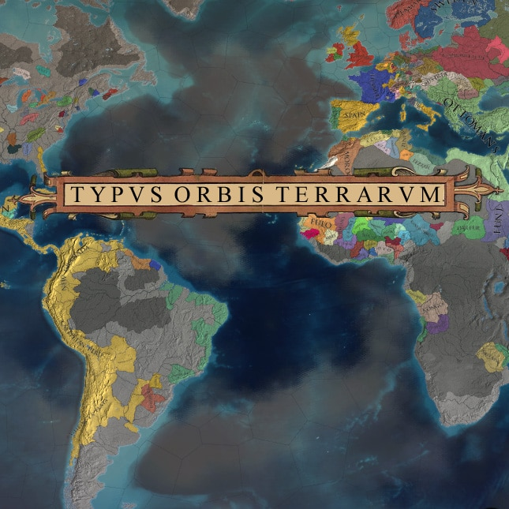

# Typus Orbis Terrarum - Renewed



[](https://github.com/Cccc-owo/typus-renewed/releases)
[](https://github.com/Cccc-owo/typus-renewed/tags)
[](https://github.com/Cccc-owo/typus-renewed/graphs/commit-activity)

## 下载 & 使用 / Download & Use

你可以在 [Releases](https://github.com/Cccc-owo/typus-renewed/releases) 中下载到本地版 Mod。

You can download the local version of the Mod in [Releases](https://github.com/Cccc-owo/typus-renewed/releases).

<details><summary>本地版使用教程 / How to use local Mod</summary>

下载 [Releases](https://github.com/Cccc-owo/typus-renewed/releases/latest) 中的 ```mod.zip```，原样解压 ```mod.zip``` 至 ```文档 > Paradox Interactive > Europa Universalis IV > mod``` 目录下。打开启动器 ```dowser.exe```（正版玩家直接启动游戏相当于打开启动器），在**边栏**的**播放集**一页中，点击右上角的**添加更多 MOD**，将本模组加入播放集。接着确保本模组启用的情况下，启用需要的其他模组，返回主页开始游戏即可。

Download the ```mod.zip``` from [Releases](https://github.com/Cccc-owo/typus-renewed/releases/latest), extract the ```mod.zip``` as is to ```Documents > Paradox Interactive > Europa Universalis IV > mod``` directory. Open the launcher (```dowser.exe```) and add this Mod to the **playlist** by clicking **Add More Mods** in the top right corner of the **playlist page** in the **sidebar**. Then make sure this Mod is enabled, enable the other Mods you need, and return to the home page to start the game.

</details>

## 文件夹结构说明 / Folders structure of the repository

|文件夹 / folder|内容 / contents|备注 / notes|
|--------------|---------------|-----------|
|[.github](.github)|GitHub 工作流文件 / GitHub workflow files||
|[cn_loc](cn_loc)|中文本地化 / Chinese Localisation files||
|[typus-renewed](typus-renewed)|模组文件 / contents of Mod||
|[mod_descriptor](mod_descriptor)|mod 描述符文件 / the descriptor of the Mod||
|output|输出文件夹 / output contents|运行 ```main.bat``` 时会自动建立|

```7z.exe``` 和 ```7z.dll``` 提取自官方 7-Zip 22.01 (2022-07-15)

```7z.exe``` & ```7z.dll``` are extracted from official 7-Zip 22.01 (2022-07-15)

## 作者 / Author

[bizarcasm](https://steamcommunity.com/profiles/76561198065307475): Original [Typus Orbis Terrarum](https://steamcommunity.com/sharedfiles/filedetails/?id=403025031)

Cccc_
